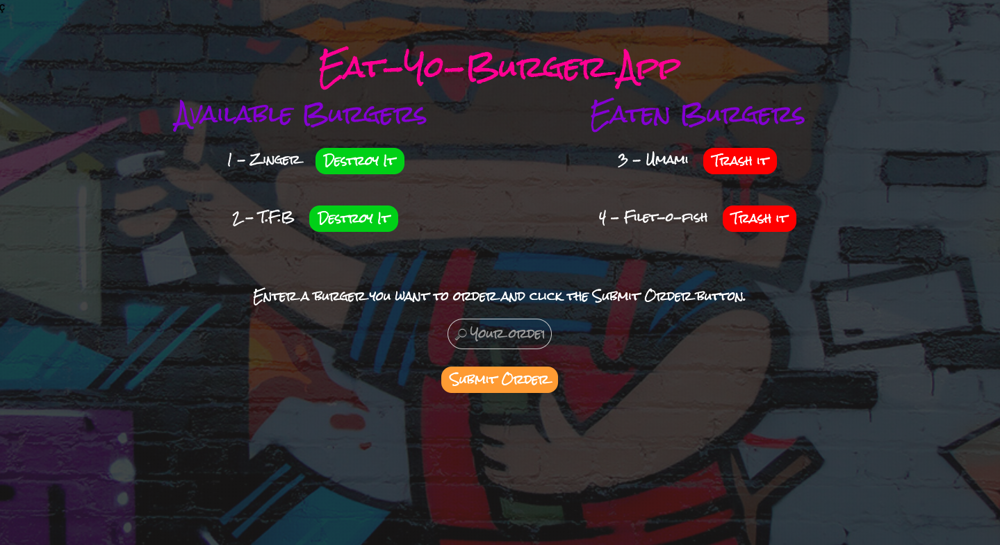
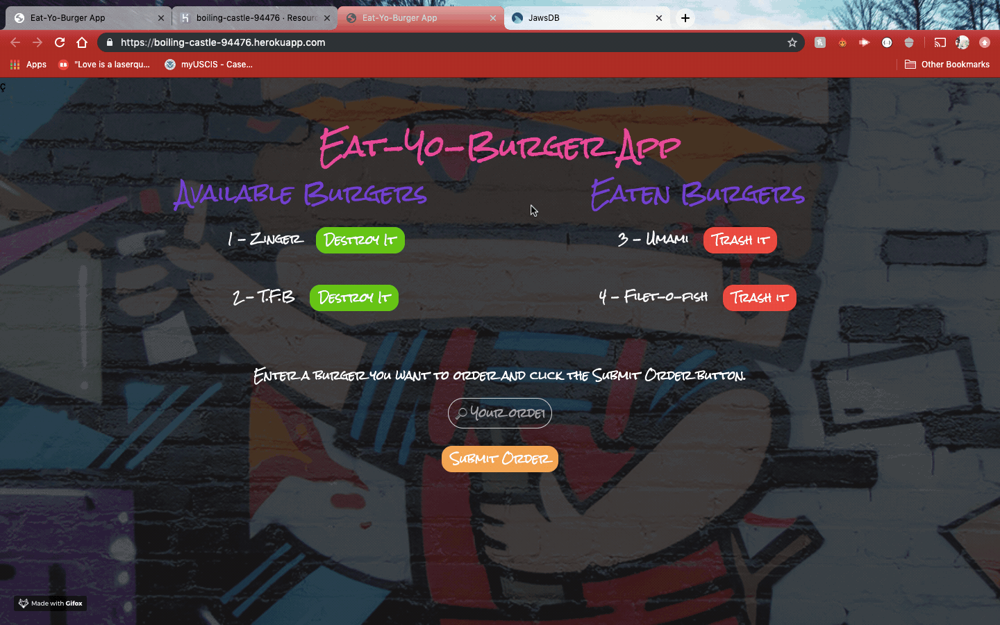

## Eat Yo Burger!

A Burger Eatin' Application With Node.js/Express/MySQL/Handlebars/Bootstrap

## Description

This application demonstrates a simple full stack application with a front end implemented with HTML/CSS and elements from the Bootstrap framework and the backend implemented with Node.js and Express. HTML templating is done with the help of Handlebars.

The user may enter any burger name to add it to the menu. This also adds the new burger entry into the MySQL database. The initial burger entry is added as *available* on the menu and placed on the left side of the screen. The user may then eat any burger by clicking on it, which moves it into the adjacent column and updates its status accordingly in the database.

## Demo

The demo of the burger eating application can be found [here](https://boiling-castle-94476.herokuapp.com/).

## Installation

To run the application locally, first clone this repository with the following command.

	git clone git@github.com:rshiv7/burger.git
	
Next, install the application dependencies.

	cd burger
	npm install
	
Finally, run the node server locally.

	node server
	
Now, open the local application on port 3000 at the URL: `http://localhost:3000/`.

**Enjoy and have a burger!**

## Built with :

* [Node](https://www.w3schools.com/nodejs/nodejs_intro.asp) 

* [Javascript](https://www.w3schools.com/js/js_intro.asp)

* [Bootstrap](https://getbootstrap.com/docs/4.3/getting-started/introduction/)

* [Express](https://expressjs.com/)

* [MySql](https://searchoracle.techtarget.com/definition/MySQL)

* [Handlebars](https://handlebarsjs.com/)

## Authors

* [Raghav Shiv](https://github.com/rshiv7)
